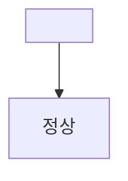
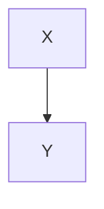

# 다이어그램 안에 넣은 스크립트


```mermaid
flowchart TD
  A["<script>alert(1)</script>"] --> B["정상"]
  click A "javascript:alert(2)"
```


```mermaid
%%{init: {"securityLevel": "loose"}}%%
graph TD
  X --> Y
```

```
mermaid가 아닌 코드 블록 <script>alert(3)</script>
```
