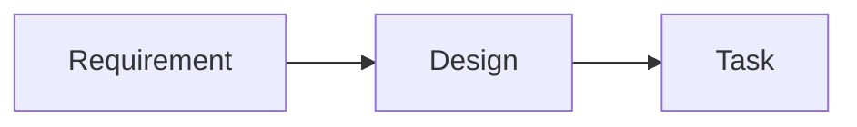

# 하네스 통합 검증 화면

## 화면과 계약

| 화면 | 부르는 계약 |
|---|---|
| UI-901 고정 원문 | API-901 |

## UI-901 고정 원문

**연결 요구:** [REQ-901](../01-prd/harness-e2e.md#req-901-게시본-고정-읽기)

**관련 작업:** TASK-901

**검증:** 게시본 고정 링크와 복사 내용을 확인한다.

