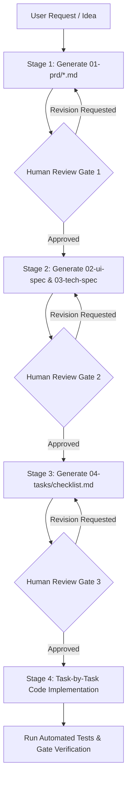

# Spec-Driven Development (SDD) Workflow & Guidelines for Codex / AI Agents

> **Document Type**: AI Agent Execution Guideline & Workflow Protocol  
> **Target Tool/Agent**: Codex, Claude Code, Cursor, OpenAI Swarm / Custom Agents  
> **Core Objective**: Prevent "Black-Box Vibe Coding" by enforcing Human-in-the-Loop approval gates through modular, human-readable Markdown artifacts.

---

## 1. Executive Summary & Problem Definition

### 1.1 The Pitfalls of Naive Vibe Coding
In traditional "Vibe Coding," developers provide high-level, ambiguous prompts directly requesting code implementation. This approach suffers from critical failure modes:
* **Loss of Architectural Control**: The AI Agent makes arbitrary architectural decisions that developers cannot track or understand.
* **Context Drift & Hallucination**: As codebase size grows, code generation becomes non-deterministic and prone to silent failures.
* **Prompt Treadmill of Hell**: Developers spend more time debugging AI-generated "black-box slop" than they would writing clean code from scratch.

### 1.2 The SDD Solution (Spec-Driven Development)
Spec-Driven Development turns the AI workflow upside down:
1. **Docs as Source of Truth**: Markdown specifications are the primary source of truth; code is merely a compiled artifact generated from specs.
2. **Human-in-the-Loop Gates**: The AI Agent MUST pause and request human review at each intermediate artifact phase before proceeding to code generation.
3. **Dual Layer Strategy (Markdown for AI, HTML for Human)**:
   * **AI Layer**: Clean, lightweight, modular Markdown (`.md`) files inside a structured `docs/` directory to minimize token consumption and noise.
   * **Human Layer**: Auto-rendered HTML documentation viewer (via VitePress, Starlight, or IDE Live Preview) featuring Mermaid diagrams, table of contents, and full-text search.

---

## 2. Rationalized Artifact Architecture (13 → 4 Modular Domains)

To eliminate document synchronization overhead while retaining 100% architectural coverage, 13 traditional Waterfall artifacts are consolidated into **4 core modular domains**:

```
docs/
├── 01-prd/                  # Domain 1: Product & Requirements
│   ├── overview.md          # Business goals, scope, background
│   └── user-stories.md      # User journeys, functional requirements, edge cases
├── 02-ui-spec/              # Domain 2: UI/UX & Frontend Spec
│   ├── design-tokens.md     # Color palette, typography, UI library rules
│   └── screen-layouts.md    # Screen hierarchy, component structure, state specs
├── 03-tech-spec/            # Domain 3: System & Technical Architecture
│   ├── architecture.md      # System topology, module dependencies (Mermaid)
│   ├── database-erd.md      # Data models, schema definitions, constraints
│   └── api-spec.md          # REST/gRPC endpoints, request/response DTOs
└── 04-tasks/                # Domain 4: Execution Engine
    └── checklist.md         # Atomic, ordered implementation checklist
```

### Mapping Matrix: Consolidation Logic

| Original Artifact (13 Items) | Consolidated Domain | Primary Markdown File | Core Contents & Key Checks |
| :--- | :--- | :--- | :--- |
| • 요구사항 명세<br>• PRD<br>• 사용자 시나리오<br>• 유스케이스 | **01-prd** | `01-prd/overview.md`<br>`01-prd/user-stories.md` | • Problem statement & target outcomes<br>• Functional requirements & Acceptance Criteria<br>• Edge case handling & business rules |
| • 디자인 시스템<br>• 화면 설계<br>• 와이어프레임<br>• 프로토타입 | **02-ui-spec** | `02-ui-spec/design-tokens.md`<br>`02-ui-spec/screen-layouts.md` | • Design tokens & UI component selection<br>• ASCII / Layout structures & component tree<br>• Loading, Error, & Empty state behaviors |
| • 시스템 아키텍처<br>• 도메인/클래스 설계<br>• ERD<br>• API 명세<br>• 시퀀스 설계 | **03-tech-spec** | `03-tech-spec/architecture.md`<br>`03-tech-spec/database-erd.md`<br>`03-tech-spec/api-spec.md` | • Component topology & sequence diagrams (Mermaid)<br>• Entity attributes, indexing, & relationships<br>• API endpoints, status codes, DTO schemas |
| *(N/A - Critical SDD Addition)* | **04-tasks** | `04-tasks/checklist.md` | • Sequential, single-responsibility tasks<br>• Target files & validation test criteria per task |

---

## 3. Step-by-Step SDD Execution Protocol

When Codex/AI Agent receives a request to build a feature or system, it MUST execute the following 4-stage pipeline sequentially.



### Stage 1: Product Requirements Definition
* **Agent Action**: Read prompt, ask clarifying questions if ambiguous, and generate `docs/01-prd/overview.md` and `user-stories.md`.
* **Human Gate**: Developer reviews business logic, user flow accuracy, and scope limits.

### Stage 2: Technical & UI Specification
* **Agent Action**: Read approved PRD. Generate `docs/02-ui-spec/` and `docs/03-tech-spec/` documents. Include Mermaid diagrams for architecture and ERD.
* **Human Gate**: Developer verifies DB normalization, API design standards, security concerns, and frontend component modularity.

### Stage 3: Task Decomposition (`TASKS.md`)
* **Agent Action**: Break down technical specs into fine-grained, dependent tasks in `docs/04-tasks/checklist.md`. Each task must be executable in under 100-200 lines of code changes.
* **Human Gate**: Developer approves implementation sequence and scope boundary per task.

### Stage 4: Incremental Implementation & Verification
* **Agent Action**: Execute ONE task at a time from `docs/04-tasks/checklist.md`. Write code and unit tests. Run automated verification (linter/tests).
* **Human Gate**: Developer approves completed task before agent moves to the next checklist item.

---

## 4. Strict Agent Rules for Codex

```yaml
rules:
  - id: R01-NO-DIRECT-CODE
    description: "NEVER write production code or create source files before PRD, Tech Specs, and Task Checklist are explicitly approved by the human developer."
  - id: R02-MODULAR-MARKDOWN
    description: "Write specifications in clean, modular Markdown under docs/. Do NOT output monolithic single-file specifications."
  - id: R03-NO-HTML-NOISE
    description: "Do NOT write specs directly in HTML. Use pure Markdown with standard tables and Mermaid code blocks for rendering compatibility."
  - id: R04-ATOMIC-TASKS
    description: "Task checklist items must be atomic (e.g., 'Task 1.1: Create User Entity & Migration Script'). Do not combine multiple layers into a single task."
  - id: R05-EXPLICIT-PAUSE
    description: "At the end of each stage (PRD, Spec, Task, Code), output an explicit approval request tag: '[WAITING FOR DEVELOPER APPROVAL]'."
```

---

## 5. Document Templates for Agent Generation

### 5.1 Template: `docs/04-tasks/checklist.md`
```markdown
# Implementation Plan & Task Checklist

- [ ] **Phase 1: Database & Core Domain Model**
  - [ ] **Task 1.1**: Define DB Schema & Migration
    - **Target Files**: `src/main/resources/db/migration/V1__init.sql`
    - **Spec Reference**: `docs/03-tech-spec/database-erd.md`
    - **Verification**: Run `./gradlew test` (Schema validation test)
  - [ ] **Task 1.2**: Implement Repository Layer & Entities
    - **Target Files**: `src/domain/user/UserEntity.java`, `UserRepository.java`
    - **Spec Reference**: `docs/03-tech-spec/architecture.md`
    - **Verification**: Write & pass `UserRepositoryTest`

- [ ] **Phase 2: API Endpoints & Business Logic**
  - [ ] **Task 2.1**: Implement User Registration Service & Controller
    - **Target Files**: `src/api/UserController.java`, `src/service/UserService.java`
    - **Spec Reference**: `docs/03-tech-spec/api-spec.md`
    - **Verification**: Integration test POST `/api/v1/users`
```

---

## 6. Developer Local Setup for HTML Preview

To view these Markdown specs as an interactive HTML documentation portal:

1. **VitePress Setup** (Node.js required):
   ```bash
   npx vitepress init docs
   ```
2. **Directory Config (`docs/.vitepress/config.js`)**:
   ```javascript
   export default {
     title: 'Project SDD Spec Portal',
     description: 'Spec-Driven Development Documentation',
     themeConfig: {
       sidebar: [
         { text: 'PRD', items: [{ text: 'Overview', link: '/01-prd/overview' }] },
         { text: 'UI Spec', items: [{ text: 'Screen Layouts', link: '/02-ui-spec/screen-layouts' }] },
         { text: 'Tech Spec', items: [{ text: 'Architecture & ERD', link: '/03-tech-spec/architecture' }] },
         { text: 'Tasks', items: [{ text: 'Task Checklist', link: '/04-tasks/checklist' }] }
       ]
     }
   }
   ```
3. **Run Dev Server**:
   ```bash
   npx vitepress dev docs
   ```
   *Access your specs live at `http://localhost:5173` with full Mermaid diagram rendering and instant search.*

---
*End of Protocol Document.*
